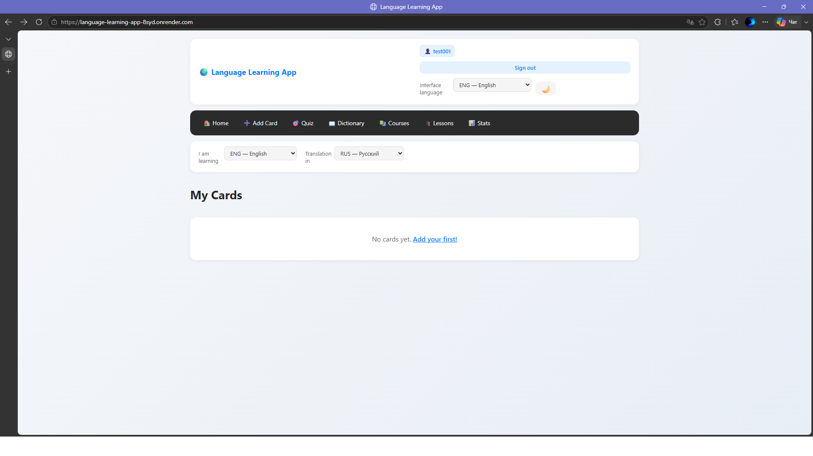
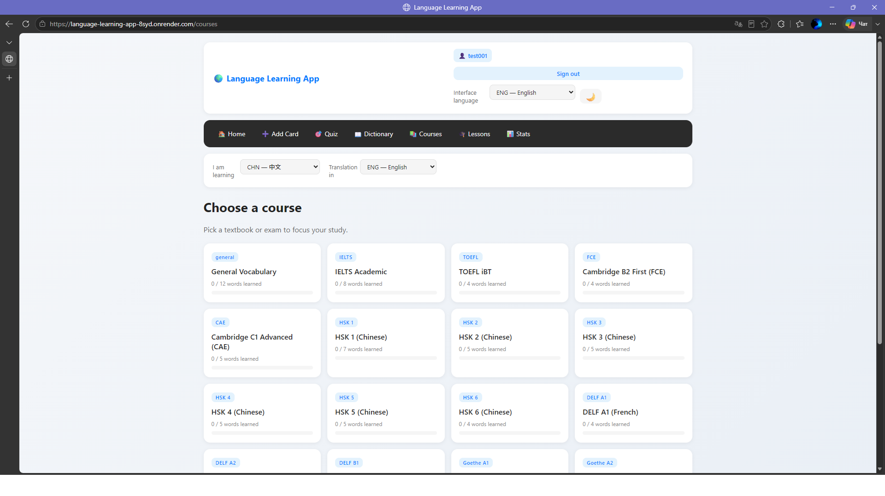
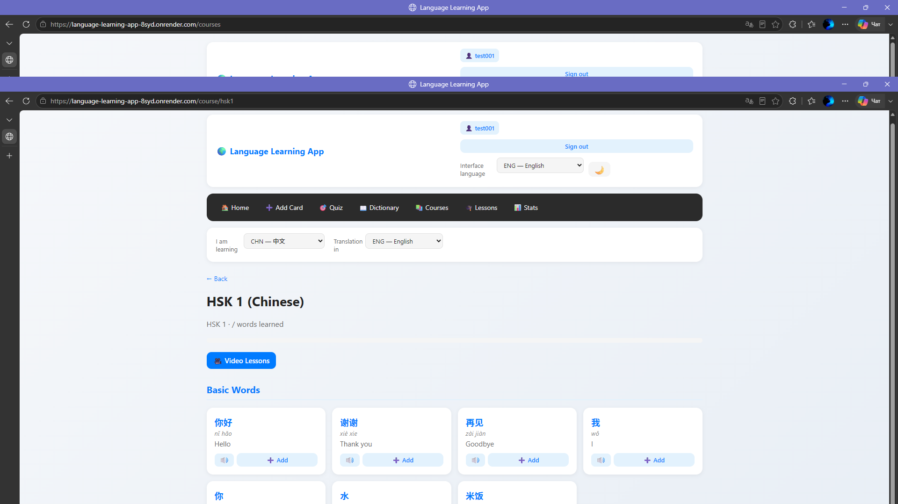
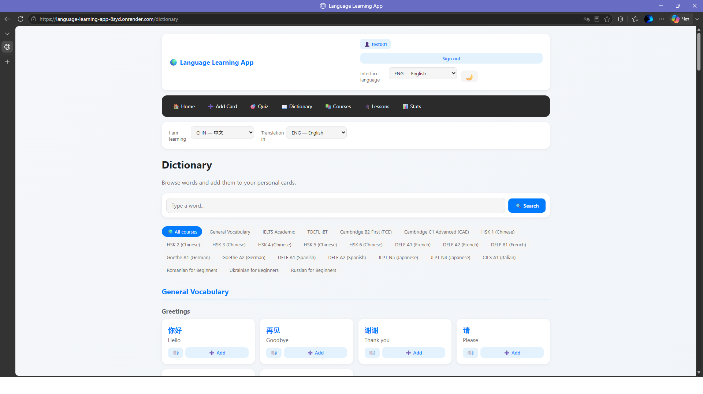
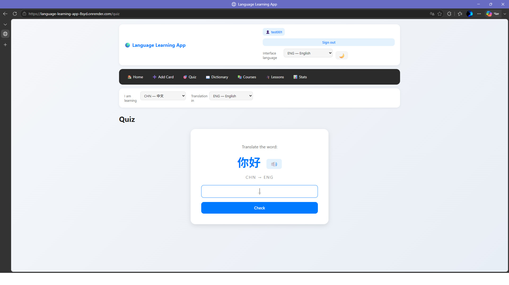
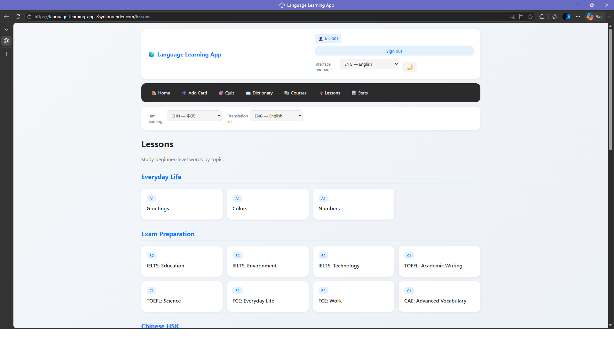

# 🌍 Language Learning App

A full-stack web application for learning **10 languages** with structured courses, flashcards, quizzes, and pronunciation. Built with **Flask** and deployed with **Docker + PostgreSQL** on **Render**.

**🔗 Live Demo:** [language-learning-app-8syd.onrender.com/](https://language-learning-app-8syd.onrender.com/)

## 📸 Screenshots

<table>
  <tr>
    <td align="center"><b>Home — my flashcard collection</b></td>
    <td align="center"><b>Courses — 20+ exams & languages</b></td>
  </tr>
  <tr>
    <td></td>
    <td></td>
  </tr>
  <tr>
    <td align="center"><b>Course with pinyin & TTS</b></td>
    <td align="center"><b>Dictionary with search</b></td>
  </tr>
  <tr>
    <td></td>
    <td></td>
  </tr>
  <tr>
    <td align="center"><b>Quiz mode</b></td>
    <td align="center"><b>Lessons by category</b></td>
  </tr>
  <tr>
    <td></td>
    <td></td>
  </tr>
</table>
---

## ✨ Features

### 🎓 Learning content
- **10 languages** — English, Russian, Romanian, Ukrainian, Chinese, Spanish, French, German, Italian, Japanese
- **20+ structured courses** covering real exams:
  - **Chinese**: HSK 1–6
  - **English**: IELTS, TOEFL, Cambridge B2/C1
  - **French**: DELF A1/A2/B1
  - **German**: Goethe A1/A2
  - **Spanish**: DELE A1/A2
  - **Japanese**: JLPT N5/N4
  - **Italian**: CILS A1
  - Romanian / Ukrainian / Russian basics
- **Beginner lessons** grouped by category (Everyday Life, Exam Prep, Travel, Business)

### 🔊 Pronunciation & scripts
- **Text-to-speech** for every word (browser API + Baidu/Google fallback)
- **Pinyin** for Chinese, **Romaji** for Japanese

### 🧠 Personal learning
- **User accounts** — register, log in, keep your own flashcards
- **Flashcard system** — add words manually or from the dictionary
- **Quiz mode** with auto-marking
- **Statistics** — track your progress
- **CSV export / import**

### 🌐 Interface
- **Multilingual UI** — the whole interface in 10 languages
- **Auto-switch** — opening a course sets the right language pair
- **Dark / light theme**
- **Responsive design** — works on desktop and mobile

### 🎥 Videos
- **Topic-based YouTube search** — one click opens a curated search
- Works for every course topic, never breaks

### 🔌 API
- **`/api/words`** — JSON endpoint for words with filters by course and language

---

## 🛠 Tech Stack

**Backend**
- Python 3.11, Flask 3.0
- Flask-SQLAlchemy 3.1, Flask-Migrate 4.0
- PostgreSQL (production), SQLite (local dev)
- Werkzeug password hashing
- Gunicorn (production WSGI server)

**Frontend**
- Jinja2, HTML5, CSS3 (custom theme system)
- Vanilla JavaScript (TTS, search, dynamic UI)

**DevOps**
- Docker + Docker Compose
- Render (cloud deployment)
- GitHub (version control)

---

## 🚀 Run Locally

### With Docker (recommended)

```bash
git clone https://github.com/Hickmanda/language-learning-app.git
cd language-learning-app
docker compose up --build
```

Open http://127.0.0.1:5000

### Without Docker

```bash
git clone https://github.com/Hickmanda/language-learning-app.git
cd language-learning-app

python -m venv venv
source venv/bin/activate      # Windows: venv\Scripts\activate

pip install -r requirements.txt
flask db upgrade
python app.py
```

Open http://127.0.0.1:5000

---

## 📖 How to Use

1. **Register** a new account.
2. Explore **Courses** to find HSK, IELTS, JLPT, or other exams.
3. Open a course and add words to your cards with one click.
4. Practise with **Quiz mode**.
5. Track progress on the **Stats** page.
6. Switch the interface language anytime in the top-right corner.

---

## 📁 Project Structure

```
language-learning-app/
├── app.py                  # Flask application
├── data/                   # Static content
│   ├── ui_translations.py  # UI strings in 10 languages
│   ├── word_bank.py        # Courses and vocabulary
│   └── lessons.py          # Categorised lessons
├── templates/              # Jinja2 templates
├── static/                 # CSS
├── migrations/             # Database migrations
├── Dockerfile
├── docker-compose.yml
├── entrypoint.sh
├── requirements.txt
└── README.md
```

---

## 💡 What I Learned

- Building a full-stack Flask application from scratch
- Database modelling with SQLAlchemy and schema migrations with Flask-Migrate
- User authentication: sessions, password hashing, `@login_required` decorators
- Multilingual interfaces: managing 10 language variants of every string
- Docker containerisation and deployment to a cloud platform
- Switching from SQLite to PostgreSQL for persistent storage
- Integrating browser TTS with an online fallback

---

## 📬 Contact

**Author:** Hickmanda
**GitHub:** [@Hickmanda](https://github.com/Hickmanda)